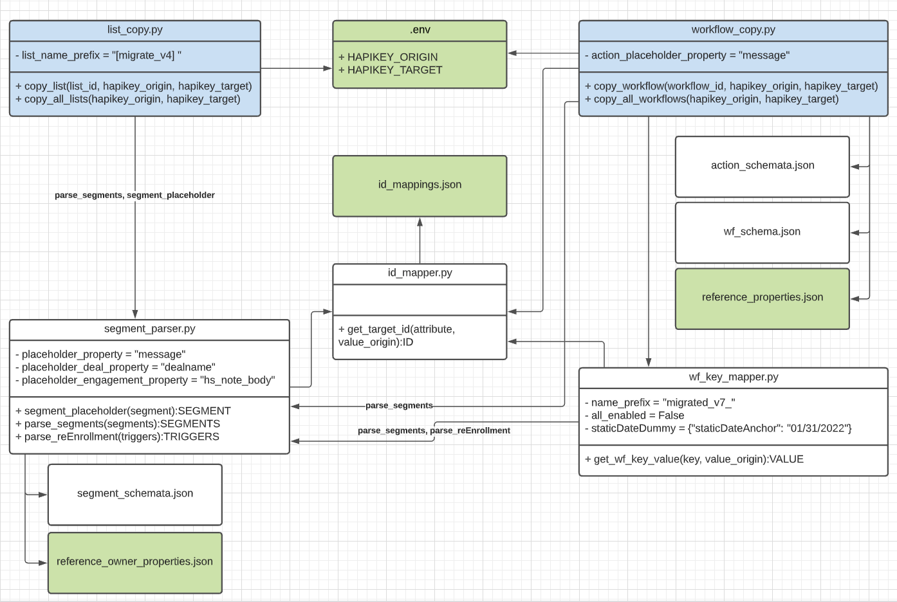

# HsWfHelper

This is a collection of scripts to faciliate a partial auto-migration of static lists, active lists, and contact-based workflows across HubSpot portals. It uses public APIs only. Various object ID mappings should exist as input files. The intention is to provide the following outputs:

* the actual migrated lists/workflows, potentially including placeholders (actions/filters that could not be re-created)
* text files enumerating all specific manual follow-up tasks that are required to complete a migration
* text files enumerating various data dependency problem (e.g. branching logic that depends on that that is not in fact migratable)
* a multiple checkbox contact property that captures the enrollment history in the origin portal
* (optionally) a specific "short-circuit" modification added to each migrated workflow that force-enrolls all contacts in the target portal that have been enrolled in the workflow in the origin portal. This is a means of inducing (mostly) correct re-enrollment behavior in the target portal

## Useful files in this repo

* "technical_limitations.md": a breakdown of what can be migrated with the current version of the public Workflows API
* "action_schemata.json" contain processing schemata for all workflow action types
* "segment_schemata.json" contain processing schemata for all filter types (used in workflow enrollment triggers, if-then-branching conditions, goal conditions, and in pre-July-2021 dynamic lists)

## Architecture

This is a "pseudo-class" diagram representation of most of the dependencies between the programs in this repositories (excluding auxiliary Node scripts). The UML class diagram analogy is as follows: "classes" are individual Python scripts, "attributes" are configuration variables specific to a script (they are actually defined in config.py), and "methods" are the "public API" functions defined in the module.

Green elements represent input files that need to be customized with each particular migration. Public elements represent the user-facing interface. An example of using that interface is represented by run_migration.py .

Note that the "global" modules logger.py (for creating log files and deriving manual follow-up task lists) and config.py are not included in the diagram.

## Configuration

* set configuration variables in config.py
* provide suitable id mapping files in the "inputs" directory 

### API keys

* Requires an ".env" file in the same directory as the ".py" file, with two lines containing api keys as follows (one for the portal of origin, and one for the destination portal):

  * `HAPIKEY_ORIGIN=f******d-2**v-4**5-9**3-7**********d`
  * `HAPIKEY_TARGET=6******5-3**2-4**4-b**1-***********4`

### Workflow action schemata

The schemata of individual workflow actions are defined in "actions_schemata.json". The keys of each action type correspond to all keys returned by the GET endpoints of the workflows API. Each key is mapped to one of the following processing actions:
* "PASS": The attribute will be written to the target portal with the same value that is read from the origin portal.
* "DROP": The attribute is not needed in the "Create Workflow" endpoint and is dropped.
* "SUBSTITUTE": When processing this attribute, the script will try and substitute references (IDs) contained in this attribute. If a substitution fails, the action is turned into a placeholder action.
* "NOT_IMPLEMENTED": If any attribute of an action has this value, the action is returned as a placeholder.

### ID mappings

The following ID mappings should be provided as a dictionary of dictionaries in the "id_mappings.json" file:
* workflowId
* emailContentId
* userId
* ownerId
* listId
* subscriptionId
* teamId
* (some additional IDs that haven't been tested yet, in particular stage and pipeline IDs, extensionIDs and extensionDefinitionIds, and appIds)

## How to run

A typical sequence of execution steps would look as follows:

1. Creat .env file with hapikeys, and customize config.py
2. supply ID mappings as CSV files
4. create contact properties "migration_placeholder_action" and "migration_placeholder_filter"
5. deal property "migration_placeholder_deal_filter"
6. node additional_node_scripts/enrollment_history_to_multiple_checkbox/app.js
7. node additional_node_scripts/enrollment_history_to_multiple_checkbox/app2_only_property_creation.js
8. node additional_node_scripts/get_all_object_properties/app.js (run "npm install" first)
9. node additional_node_scripts/migrate_static_lists/migrateEmptyLists.js (run "npm install" first)
10. node additional_node_scripts/migrate_static_lists/addContactsToLists.js
11. install python3 dependencies (sorry requirements.txt still missing, basically dotenv-python, pandas, and requests)
12. python3 create_input_files.py
13. (repeat this step until it resolves without error) python3 copy_all_lists(simulate=True) # via run_migration.py
14. (repeat this step until it resolves without error) python3 copy_all_workflows(simulate=True) # via run_migration.py
15. copy_all_lists(simulate=False)  # via run_migration.py, uncomment logger.write_log and logger.write_todo to create appropriate work files for manual follow-up
16. create_input_files.py # this patches in the list ID mappings from steps 15 and 9
17. copy_all_workflows(simulate=False) # via run_migration.py # via run_migration.py, uncomment logger.write_log and logger.write_todo to create appropriate work files for manual follow-up
18. additional_node_scripts/enrollment_history_to_multiple_checkbox/app2.js
19. manual follow-up: consult the csv "todo" files created in steps 15 and 17

## Current limitations

In addition to the limitations laid out in "technical_limitations.md", right now the script has the following limitations:
* the following additional action types are migrated as placeholders:
  * webhook actions with request signatures
  * "rotate owner"
  * "create ticket" and "create deal" actions
  * workflow extension actions
